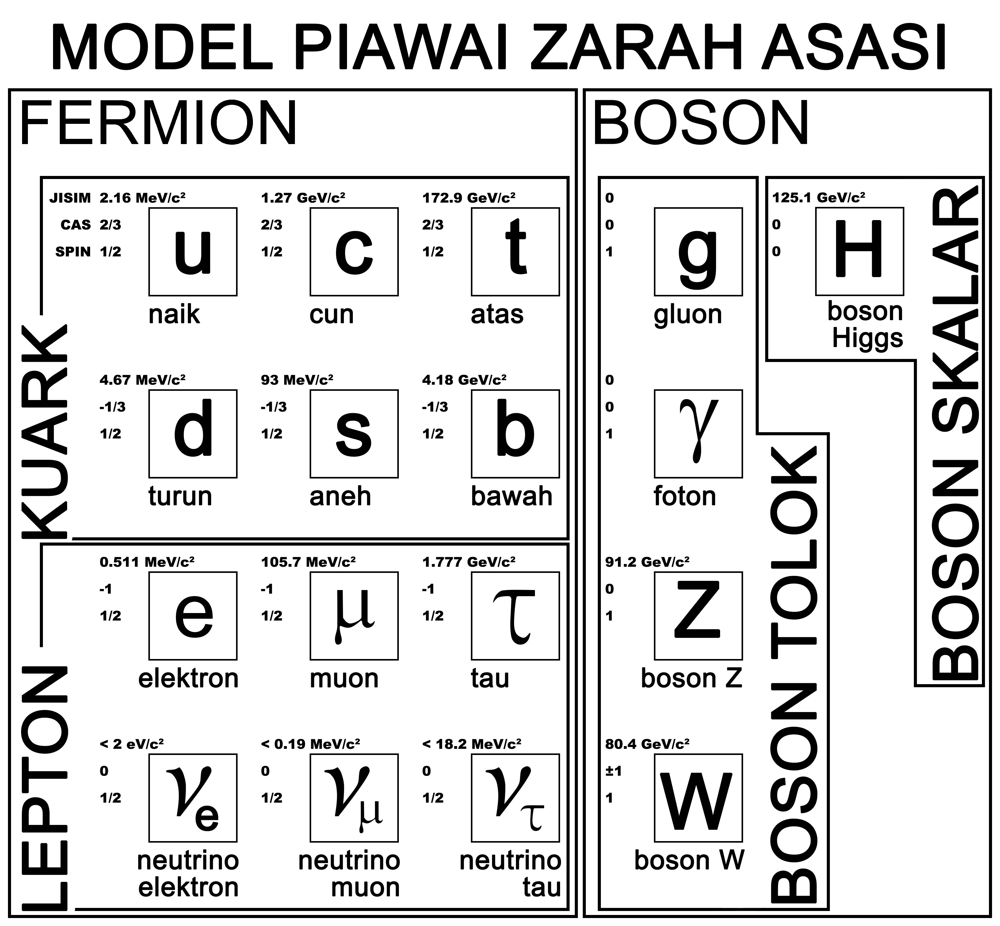
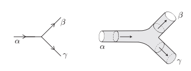

# Pengenalan


## Permulaan Mekanik Kuantum
Ketika meneliti warna-warna cahaya gas atom sejenis, Werner Heisenberg mengemukakan mekanik matriks dengan bantuan Pascual Jordan dan Max Born \citep{Connes1994, Crease2002}. Mekanik matriks merupakan bentuk terawal mekanik kuantum yang akhirnya digandingkan bersama persamaan Schr&ouml;dinger. Hasil daripada mekanik matriks, beliau dapati wujudnya perhubungan ini,
\begin{equation}
\comm{p}{x} = i\hbar,
\label{1-0}
\end{equation}
dengan maksud bahawa $p$ ialah momentum zarah, $x$ adalah kedudukan zarah, dan  $\comm{p}{x}$ adalah penukar tertib yang mewakili $px - xp$.

Perhubungan ini menatijahkan satu hubungan ketakpastian: kejituan cerapan kedudukan akan mengganggu kejituan cerapan momentum. Tafsiran Heisenberg terhadap ketakpastian ini ialah bahawa pelanggaran antara foton dan elektron yang dilakukan sewaktu pencerapan akan mengganggu kedudukan elektron atau momentumnya atau kedua-duanya sekali. Ketakpastian tersebut ditulis,
\begin{equation}
\Delta x\Delta p \geq \frac{\hbar}{2}.
\end{equation}
Hubungan ketakpastian ini merupakan tunjang mekanik kuantum dan termasuk dalam 10 persamaan agung seperti yang disenaraikan oleh \citet{Crease2002}.

## Model Piawai dan Teori Tetangsi

Mekanik kuantum sudah berkembang pesat sejak pengenalan ketakpastian Heisenberg dan persamaan Schr&ouml;dinger. Ahli Fizik sudah mengenalpasti dua jenis zarah, iaitu fermion dan boson. Fermion adalah zarah-zarah kebendaan seperti elektron dan bahan binaan atom yang lain. Boson pula ialah sejenis zarah pembawa daya yang membolehkan para zarah berinteraksi sesama sendiri \citep{Elert}. Misalnya, boson foton ialah boson yang membawa daya elektromagnet yang membolehkan zarah bercas berinteraksi dengan zarah bercas yang lain.

<!--Sepanjang sejarah perkembangan fizik, banyak kejayaan besar telah dicapai apabila dua teori berbeza berjaya disatukan \cite{Dirac1989}. Isaac Newton telah memberikan lonjakan besar kepada dunia fizik ketika menyatukan fizik samawi dan fizik bumi dalam kerangka graviti beliau yang melahirkan mekanik klasik \cite{Crease2002}. Persamaan-persamaan Maxwell pula telah menyatukan teori keelektrikan dan kemagnetan dalam satu kerangka baharu, iaitu kerangka keelektromagnetan. Albert Einstein pula menyatukan mekanik klasik dan keelektromagnetan dalam kerangka kenisbian khasnya \cite{Zwiebach2009}. Hal-hal ini dikira sebagai satu lonjakan besar dalam sejarah fizik.-->

```{r piawai, fig.env="figure" ,echo=FALSE, fig.align='center', out.width='\\textwidth', fig.cap="Nama-nama zarah asasi yang diketahui dalam Model Piawai, simbolnya serta maklumat jisim, cas dan spinnya. \\\\ \\source{Dihasilkan sendiri oleh penulis. Data diperoleh dari \\citet{Elert}}"}

```

\par
Teori tetangsi bermula sebagai satu usaha untuk menerangkan boson-boson ini \citep{Polchinski2002}. Jadinya, bentuk terawal teori tetangsi merupakan teori tetangsi kebosonan. Model piawai yang berjaya dibangunkan ketika itu mampu menerangkan boson-boson serta fermion-fermion dalam kerangka Teori Medan Kuantum. Rajah \@ref(fig:piawai) merupakan model piawai yang menyenaraikan zarah-zarah yang dianggap asasi keunsurannya.

Hal ini menyebabkan teori tetangsi sebagai teori boson diketepikan. Namun begitu, teori tetangsi sudah berevolusi dan kini bukan sahaja mampu menerangkan zarah-zarah fermion dan boson yang diketahui tetapi mampu menjadi calon teori graviti kuantum. Seperti yang dilihat dalam rajah \@ref(fig:piawai), boson-boson yang dimuatkan dalam model piawai mewakili tiga daripada empat daya asasi alam. Daya elektromagnet diwakili oleh boson foton. Daya kuat pula diwakili boson gluon manakala daya lemah pula diwakili boson $Z$ dan $W$. Dapat dilihat bahawa daya graviti tiada perwakilan oleh mana-mana boson dalam Model Piawai. Padanan-padanan ini dirumuskan dalam jadual \ref{tab:graviton}.

\begin{table} [hbt!]\centering
\caption{Nama daya-daya asasi alam serta boson yang mewakilinya dalam Model Piawai.}
\label{tab:graviton}
\begin{tabular}{r | l}
\hline
Daya Asasi Alam & Boson Tolok\\ \hline
Elektromagnet & Foton, $\gamma$\\
Daya Kuat & Gluon, $g$\\
Daya Lemah & Boson $Z$ dan $W$\\
Graviti & -- \\
\hline
\end{tabular}
\end{table}

\par
Walaupun fizikawan terkini sudah tahu cara mengkuantumkan tiga daya yang disebutkan, proses mengkuantumkan graviti ternyata menimbulkan masalah \citep{Zwiebach2009, Schellekens2014}. Salah satu sebabnya ialah kita tidak tahu tentang kelakuan graviti pada jarak sekecil panjang Planck, $\ell_p$ \citep{Wray2011}. Selain itu, perkiraan tentang graviti pada skala tersebut membawa kepada nilai-nilai infiniti \citep{Schellekens2014}. Setiap interaksi akan menghasilkan lingkaran demi lingkaran lalu pelbagai parameter diperlukan untuk mematikan beberapa interaksi. Didapati pula jumlah parameter yang diperlukan dalam mengkuantumkan graviti meningkat sehingga infiniti \citep{Wray2011, Schellekens2014}. Lebih parah lagi, kita tidak boleh sahkan setiap satu parameter ini kerana ia memerlukan tenaga melebihi kemampuan pemecut zarah terbaik kita!

Ahli-ahli fizik tetangsi yakin bahawasanya masalah yang dikemukakan oleh graviti kuantum ini mampu diselesaikan oleh teori tetangsi \citep{Zwiebach2009, Wray2011, Schellekens2014}. Dalam teori tetangsi, setiap satu zarah (termasuklah setiap satu pembawa daya) merupakan sejenis objek bermatra-1 bernama tetangsi \citep{Zwiebach2009, Polchinski2002}. Tetangsi dalam mod getaran berbeza mewakili zarah-zarah berbeza. Ia dijangka mampu membina semula model piawai dan menerangkan graviti kuantum sekaligus.

\par
Graviti kini merupakan sejenis tetangsi tidak berjisim dan berspin--2 yang bernama `graviton', $G_{\mu\nu}$ \cite{Polchinski2002}. Samalah juga dengan daya-daya asasi lain kini hanya diperihalkan dalam tetangsi masing-masing (dengan nama yang sama seperti dalam Jadual \ref{tab:graviton}). Apa yang lebih menariknya ialah, graviton ini muncul dengan sendirinya dalam kerangka teori ini \citep{Ginsparg1989, Polchinski2002}!

<!--```{r tetangsi, fig.env="figure" ,echo=FALSE, fig.align='center', fig.cap="Proses $\\alpha \\rightarrow \\beta + \\gamma$ yang digambarkan sebagai proses pereputan zarah (kiri) dan sebagai proses pereputan tetangsi (kanan). \\\\ \\source{\\citet{Zwiebach2009}}"}

```

\par
Tetangsi ada dua cara untuk berinteraksi dengan tetangsi lain, iaitu dengan bercantum atau dengan mereput. Dua tetangsi akan bercantum menjadi satu tetangsi baru, ataupun satu tetangsi boleh mereput menjadi dua tetangsi baru. Ia juga boleh bercantum dan mereput menyerupai satu pelanggaran.-->

Ada satu kekurangan teori tetangsi, iaitu ia mengandaikan kewujudan matra-matra ruang--masa tambahan yang tersembunyi. Ada sejumlah $N=11$ matra ruang--masa yang diperlukan untuk menerangkan teori tetangsi \citep{Zwiebach2009}. Matra-matra ini tergulung mampat sehingga hanya zarah-zarah kecil sahaja yang mampu memasukinya. Kewujudan matra-matra tersembunyi ini merupakan andaian besar yang sukar diterima ahli-ahli fizik lain. Adapun begitu, ahli-ahli fizik tetangsi menerimanya seadanya sebagai satu natijah yang tidak dapat dielakkan sebagaimana penatijahan bahawa ruang dan masa perlu disatukan dalam kerangka yang sama dalam Teori Kenisbian Einstein.

## Susun Atur Tesis Ini
Jika teori tetangsi ingin diterima sebagai satu teori yang berwibawa untuk fizik-fizik kezarahan, ia perlu mampu mendukung teori-teori sedia ada. Tesis ini telah memperkenalkan prinsip ketakpastian Heisenberg sebagai perhubungan yang penting iaitu sebagai tunjang mekanik kuantum. Tesis ini akan cuba memperoleh prinsip ketakpastian Heisenberg melalui persamaan dasar teori tetangsi.

Bab 2 sehingga 3 akan dikhususkan untuk memperoleh persamaan mendasar teori tetangsi. Kaedah yang digunakan untuk memperoleh persamaan ini ialah melalui tindakan Nambu--Goto. Oleh itu, bab 2 digunakan untuk memperkenalkan konsep tindakan serta bagaimana ingin memperoleh persamaan pergerakan menggunakannya.

Dalam bab 3, tindakan Nambu--Goto akan diperoleh menggunakan keluasan lembar dunia suatu tetangsi. Seterusnya, persamaan pergerakan akan diperoleh daripada tindakan tersebut, lalu boleh dimunculkan persamaan untuk kedudukan suatu titik tetangsi dan momentum tetangsi tersebut.

Daripada persamaan pergerakan yang diperoleh dalam bab 3, prinsip ketakpastian akan diperoleh dalam bab 4. Bab 4 akan menggariskan dua kaedah pemerolehan prinsip ketakpastian Heisenberg. Yang pertama ialah melalui penukar tertib manakala yang kedua ialah melalui kaedah \citet{Boichenko2018}. Selepas itu, ia akan menyentuh tentang satu pengitlakan yang patut wujud dalam teori-teori graviti kuantum iaitu prinsip ketakpastian teritlak. Ia akan membincangkan bagaimana teori tetangsi menatijahkan prinsip ketakpastian teritlak ini serta kelemahan-kelemahannya.

Seterusnya, bab 5 akan merumuskan dapatan tesis ini. Penambahbaikan yang boleh memajukan kajian juga akan dikemukakan.