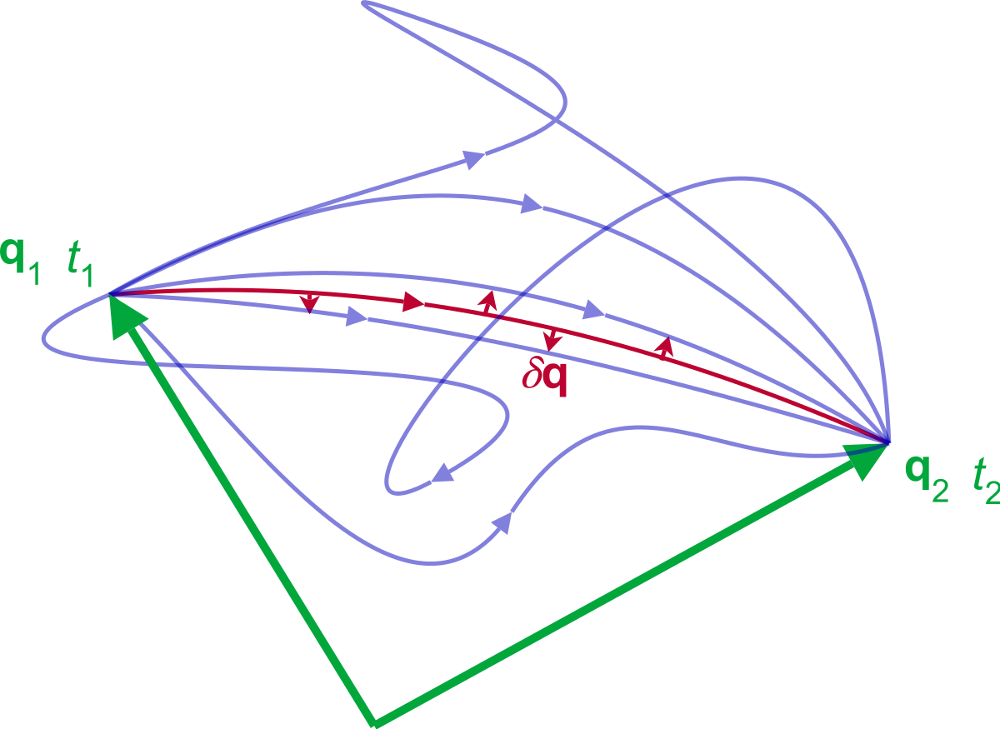

# Dinamik Zarah

## Garis Dunia Zarah

Pergerakan suatu zarah melakarkan satu garis pada ruang--masa alam ini. Selang antara dua peristiwa dalam garis dunia ialah,
\begin{equation}
\dd x_\mu\dd x^\mu = \eta_{00}\dd x^0\dd x^0 + \eta_{11}\dd x^1\dd x^1 + \eta_{22}\dd x^2\dd x^2 + \eta_{33}\dd x^3\dd x^3,
\end{equation}
untuk ruang--masa Minkowski. Selang $\dd x^0$ ialah selang masa manakala $\dd x^1$ sampai $\dd x^3$ mewakili selang ruang. Terdapat sejumlah 4 koordinat yang perlu diambil kira. Keempat-empat koordinat ini ialah koordinat ruang--masa,
\begin{equation}
x^\mu = (ct, x, y, z).
\label{a2}
\end{equation}
Simbol $\eta_{\mu\nu}$ pula ialah tensor metrik yang memerihalkan ruang yang didiami koordinat tersebut. Koordinat ruang--masa mendiami ruang Minkowski, jadi tensor metrik $\eta_{\mu\nu}$ ialah metrik Minkowski yang boleh diwakili sebegini,
\begin{equation}
\eta_{\mu\nu} = \begin{pmatrix} \dmat[0]{-1, 1, 1, 1}\end{pmatrix}.
\label{a6}
\end{equation}
Namun begitu, harus ditegaskan bahawa metrik $\eta_{\mu\nu}$ bukanlah suatu matriks tetapi suatu tensor. Ia hanya ditulis begitu untuk memudahkan pengungkapannya.


Nilai $\dd x_\mu\dd x^\mu$ pula mewakili hasil darab dalaman antara vektor $\dd x^\mu$ dan $\dd x^\mu$. Kesannya adalah sama dengan meletakkan kuasa dua pada $\dd x^\mu$,
\begin{equation}
\dd x_\mu\dd x^\mu = \dd x^\mu \vdot \dd x^\mu = \qty(\dd x^\mu)^2.
\end{equation}
Jadinya, hasil darab dalaman selang $\dd x^\mu$ ialah,
\begin{equation}
\dd x_\mu\dd x^\mu = \sum_{\mu,\nu=0}^{3} \eta_{\mu\nu}\dd x^\mu \dd x^\nu.
\label{a-dalam}
\end{equation}
Lazimnya, tanda penjumlahan $\sum$ itu tidak diletakkan kerana penjumlahannya ketara melalui konteks. Khususnya, apabila wujud indeks bawah dan indeks atas yang sama tandanya, wujudlah juga penjumlahan dalam julat yang disebut. Penulisan sebegini adalah mengikut kaedah tatatanda Einstein. Oleh itu, pers. (\ref{a-dalam}) adalah setara dengan
\begin{equation}
\dd x_\mu\dd x^\mu = \qty(\dd x^\mu)^2 = \eta_{\mu\nu}\dd x^\mu \dd x^\nu.
\end{equation}
Itulah persamaan untuk selang antara garis dunia dalam ruang Minkowski, ataupun apabila mengambil kira nilai metrik (pers. \ref{a6}) dan koordinat ruang--masa (pers. \ref{a2}), persamaan penuhnya adalah begini,
\begin{equation}
(\dd x^\mu)^2 = - (c\dd t)^2 + (\dd x)^2 + (\dd y)^2 + (\dd z)^2.
\end{equation}

\par
Pers. (\ref{a-dalam}) adalah sah untuk hasil darab dalaman mana-mana vektor dan bukan untuk selang peristiwa semata-mata. Selain itu, kita juga akan dapati bahawa metrik $\eta_{\mu\nu}$ boleh digunakan untuk menaikkan indeks apabila pers. (\ref{a-dalam}) dibahagikan dengan $\dd x^\mu$,
\begin{equation}
\dd x_\mu = \eta_{\mu\nu}\dd x^\nu.
\end{equation}
Vektor berindeks atas ialah vektor kontravarian dan vektor berindeks bawah ialah vektor kovarian. Kita akan gunakan hakikat ini untuk mengubah momentum tetangsi dari bentuk kovarian menjadi bentuk kontravarian dalam bahagian \@ref(persamaan-kedudukan-dan-momentum) nanti. Semua ini tersedia dalam buku-buku pengenalan tensor seperti dalam \citet{Islam2006}, \citet{Sharipov2004}, dan \citet{Dullemond2010}.

## Prinsip Tindakan Pegun

Bagi mencari garis dunia yang dilintasi zarah, kita akan menggunakan tindakan zarah tersebut. Suatu tindakan ialah hasil kamiran Lagrangian, $L$, terhadap masa, $t$ \citep{Zwiebach2009},
\begin{equation} \label{action}
S \equiv \int_{t_0}^{t_1}{L\qty(x,\dot{x},t)} \dd{t}.
\end{equation}
Fungsi Lagrangian, atau lazimnya disebut Lagrangian sahaja, merupakan suatu fungsi tenaga kinetik, $T$, yang bergantung kepada halaju, $\dot{x}$, tolak tenaga upaya, $V$, yang bergantung kepada kedudukan, $x$, \citep{Morin2007},
\begin{equation} \label{lagrangian}
L \equiv T(\dot{x}) - V(x).
\end{equation}
Oleh itu, ia mempunyai dimensi tenaga dengan unit $J$. Natijahnya, fungsi tindakan mendukung dimensi tenaga darab masa dengan unit $J\cdot s$.

Ada pelbagai lintasan yang boleh diambil boleh suatu zarah. Persamaan (\ref{action}) boleh digunakan untuk mencari lintasan sebenar zarah tersebut, ataupun gunakannya untuk memahami sifat-sifat Lagrangian zarah tersebut sekiranya ia berada pada lintasan sebenar ini  \citep{Gross2010}.

```{r fig-pegun, echo=FALSE, fig.align='center', out.width="200px", fig.cap="Gambaran bagaimana zarah-zarah boleh mengambil pelbagai lintasan untuk bergerak dari titik $q_1$ ke titik $q_1$. Prinsip Tindakan Pegun membenarkan kita mencari lintasan yang akan dipilih oleh zarah ini.\\\\ \\source{Maschen melalui wikimedia (CC0 1.0)}"}

```

Prinsip Tindakan Pegun menyatakan bahawa lintasan sebenar yang dilalui oleh mana-mana zarah ialah lintasan yang menghasilkan tindakan pegun \citep{Zwiebach2009, Malham2016}. Katalah suatu tindakan $S$ boleh berubah mengikut suatu parameter $q$, maka tindakan pegun adalah tindakan yang mengalami perubahan sifar sekiranya dilakukan pembezaan darjah pertama $S$ terhadap $q$,
\begin{equation} \label{pegun}
\dv{S}{q} = 0 .
\end{equation}

\par
Harus disebut juga bahawa titik mula dan titik akhir tidak berubah. Kita sedang menilai lintasan-lintasan yang boleh muncul dari suatu titik mula ke suatu titik akhir. Oleh itu, sempadan-sempadan lintasan ini wajib dipegunkan bersama dengan tindakan yang dipegunkan. Itulah syarat sempadan yang dikenakan terhadap penilaian kita,
\begin{equation} \label{boundary}
\pdv{x\qty(t_0)}{q} = \pdv{x\qty(t_1)}{q} = 0.
\end{equation}

Setelah itu, kita boleh mulakan penilaian kita dengan memasukkan pers. (\ref{action}) ke dalam pers. (\ref{pegun}),
\begin{equation} \label{S1}
\dv{S}{q} = \dv{q} \int_{t_0}^{t_1}{L\qty(x,\dot{x},t)}\dd{t} = 0.
\end{equation}
Pembezaan $\dv{q}$ akan dimasukkan sekali dalam kamiran terhadap $\dd{t}$ kemudian ia akan menjadi pembezaan separa seperti yang telah ditunjukkan oleh \citet{Malham2016}. Setelah itu, kita boleh bezakan $L$ terhadap parameter tersebut,
\begin{equation} \label{S2}
\dv{q} \int_{t_0}^{t_1}{L\qty(x,\dot{x},t)}\dd{t} = \int_{t_0}^{t_1}{\pdv{q} L\qty(x,\dot{x},t)}\dd{t} = 0.
\end{equation}

\par
Memandangkan $L$ tidak bergantung terus kepada $q$, kita perlu kaitkan perubahan $x$ dan $\dot{x}$ terhadap $q$. Hal itu boleh dicapai menggunakan petua rantai. Kurungan $(x,\dot{x},t)$ sudah boleh dipadam kerana ia telah memenuhi tujuannya iaitu mengingatkan kita tentang pembolehubah-pembolehubah yang wujud dalam $L$ lalu membolehkan kita melakukan petua rantai dengan betul,
\begin{equation} \label{S3}
\int_{t_0}^{t_1}\qty(\pdv{L}{x}\pdv{x}{q} + \pdv{L}{\dot{x}}\pdv{\dot{x}}{q})\dd{t} = 0.
\end{equation}
Pemadaman kurungan tersebut membolehkan kita menulis persamaan dengan lebih pendek dan padat.

Sebutan kedua dalam pers. (\ref{S3}) itu boleh dikembangkan lagi dengan menggunakan kamiran cebis demi cebis,
\begin{equation} \label{S4}
\int_{t_0}^{t_1} \pdv{L}{\dot{x}}\pdv{\dot{x}}{q}\dd{t} = \qty[\pdv{L}{\dot{x}}\pdv{x}{q}]_{x(t_0)}^{x(t_1)} - \int_{t_0}^{t_1} \dv{t}\qty[\pdv{L}{\dot{x}}]\pdv{x}{q}\dd{t}.
\end{equation}
Apabila pers. (\ref{S4}) dimasukkan ke dalam pers. (\ref{S3}), persamaan
\begin{equation} \label{S5}
\int_{t_0}^{t_1}\qty(\pdv{L}{x} - \dv{t}\qty[\pdv{L}{\dot{x}}]) \pdv{x}{q}\dd{t} + \qty[\pdv{L}{\dot{x}}\pdv{x}{q}]_{x(t_0)}^{x(t_1)} = 0,
\end{equation}
boleh dimunculkan dengan sedikit penyusunan agar sebutan sepunya disekalikan. Syarat sempadan kita (pers. \ref{boundary}) menyebabkan sebutan $\qty[\pdv{L}{\dot{x}}\pdv{x}{q}]_{x(t_0)}^{x(t_1)}$ menjadi sifar. Kini, kita ditinggalkan dengan sebutan kamiran
\begin{equation} \label{S6}
\int_{t_0}^{t_1}\qty(\pdv{L}{x} - \dv{t}\qty[\pdv{L}{\dot{x}}])\pdv{x}{q}\dd{t} = 0.
\end{equation}

\par
Memandangkan $x$ mewakili titik-titik lintasan, dan $q$ adalah parameter yang mengubah laluan lintasan, maka kita tahu $\pdv{x}{q}$ wujud untuk semua nilai $x$ kecuali untuk sempadan-sempadannya seperti yang digambarkan dalam rajah \@ref(fig:fig-pegun). Oleh itu, nilai $\pdv{x}{q}$ pastinya bukan sifar. Maka, kita boleh simpulkan bahawa persamaan dalam kurunganlah yang mempunyai nilai sifar,
\begin{equation} \label{E-L}
\pdv{L}{x} - \dv{t}\pdv{L}{\dot{x}} = 0.
\end{equation}
Inilah persamaan Euler--Lagrange \citep{Malham2016, Zwiebach2009}. Persamaan ini boleh digunakan untuk memunculkan maklumat penting dalam pergerakan zarah merentasi lintasan bertindakan pegun. Oleh itu, fungsinya adalah setara dengan persamaan pergerakan.

## Persamaan Pergerakan Dalam Persamaan Euler--Lagrange

Untuk melihat bagaimana persamaan Euler--Lagrange ini berfungsi sebagai persamaan pergerakan, mari kita lihat penilaian Lagrangian untuk jasad yang berada dalam jatuh bebas. Dalam jatuh bebas, tenaga kinetik jasad tersebut ialah $\frac{1}{2}m\dot{x}$ manakala tenaga upaya jasad tersebut bergantung kepada pengaruh graviti, $mgx$. Oleh itu, Lagrangian jasad tersebut ialah
\begin{equation} \label{motion2}
L = \frac{1}{2}{m}\dot{x}^2 - mgx,
\end{equation}
dengan maksud bahawa $m$ ialah jisim jasad, $x$ ialah ketinggian jasad tersebut dari permukaan bumi, $\dot{x}$ ialah halaju jasad, dan $g$ ialah pecutan jasad dalam pengaruh graviti.

Kita akan peroleh persamaan Euler--Lagrange dengan membezakan $L$ terhadap $\dot{x}$ dan terhadap $x$ secara berasingan,
\begin{align}
\pdv{L}{\dot{x}} &= m\dot{x},\label{motion3}\\
\pdv{L}{x} &= - mg.\label{motion4}
\end{align}
Oleh itu, persamaan Euler--Lagrange boleh diperolehi dengan menggantikan pers. (\ref{motion3}) dan pers. (\ref{motion4}) ke dalam pers. (\ref{E-L}),
\begin{equation} \label{motion5}
-mg - \dv{t}\qty(m\dot{x}) = 0.
\end{equation}

\par
Sebutan $\dot{x}$ itu adalah pembezaan darjah pertama $x$ terhadap masa iaitu $\dv{x}{t}$. Maka, sebutan $\dv{t}\qty(m\dot{x})$ itu boleh diringkaskan lagi dengan menambah satu lagi titik di atas $\dot{x}$ menjadi $\ddot{x}$. Ini adalah pecutan jasad tersebut. Jika pers. (\ref{motion5}) dibahagikan dengan $m$, kita peroleh
\begin{equation} \label{motion}
\ddot{x} = -g.
\end{equation}
Ini adalah pecutan jasad tersebut dalam pengaruh graviti. Sememangnya hal ini yang dijangkakan dalam kejadian jatuh bebas. Berdasarkan maklumat ini, persamaan pergerakan jasad tersebut boleh dimuncul dengan pengamiran terhadap $t$ secara berperingkat untuk dapatkan maklumat halaju dan kedudukannya,
\begin{align}
\mathnormal{\ddot{x}} &= -g\\
\mathnormal{\dot{x}} &= \int \mathnormal{\ddot{x}} \dd{t} = -gt + \mathnormal{\dot{x}_0}\\
x &= \int \mathnormal{\dot{x}} \dd{t} = -\frac{1}{2}gt^2 + \mathnormal{\dot{x}_0}t + x_0
\end{align}
Persamaan Euler--Lagrange akan memberikan kita maklumat yang penting berkaitan pergerakan tersebut, lalu kita boleh munculkan persamaan yang sesuai berdasarkan maklumat tersebut.


## Kekalisan Koordinat Dalam Persamaan Euler--Lagrange

Persamaan Euler--Lagrange tidak bergantung kepada sistem koordinat yang digunakan. Maknanya, jika sistem koordinat ditukar sekalipun, persamaan Euler--Lagrange tetap sah digunakan. Sifat ini dikatakan kalis tukar koordinat. Bahagian ini digunakan untuk buktikan kebenaran sifat ini.

Katakan wujud sistem koordinat sembarangan $r$ dan ia boleh dikaitkan dengan koordinat $x$ melalui ungkapan
\begin{equation} \label{ko1}
x = x(r).
\end{equation}
Lalu, pembezaan pers. (\ref{ko1}) terhadap masa boleh dikaitkan menggunakan petua rantai,
\begin{equation} \label{ko2}
\dot{x} = \pdv{x}{r}\dot{r}.
\end{equation}
Daripada persamaan ini juga, boleh dilihat bahawa
\begin{equation} \label{ko3}
\pdv{\dot{x}}{\dot{r}} = \pdv{x}{r}.
\end{equation}

Lagrangian bagi koordinat baharu $r$ ini dihubungkan melalui koordinat lama $x$. Begitu juga, halaju baharu $\dot{r}$ dalam $L$ dihubungkan melalui halaju lama $\dot{x}$. Petua rantai digunakan untuk kedua-dua pembezaan tersebut,
\begin{align}
\pdv{L}{r} &= \pdv{L}{x}\pdv{x}{r},\label{ko4}\\
\pdv{L}{\mathnormal{\dot{r}}} &= \pdv{L}{\mathnormal{\dot{x}}}\pdv{\mathnormal{\dot{x}}}{\mathnormal{{\dot{r}}}}.\label{ko5}
\end{align}

Pers. (\ref{ko3}) boleh dimasukkan dalam pers. (\ref{ko5}) untuk menggantikan pembezaan separa $\pdv{\dot{x}}{\dot{r}}$ menjadi pembezaan separa $\pdv{x}{r}$,
\begin{equation} \label{ko6}
\pdv{L}{\dot{r}} = \pdv{L}{\dot{x}}\pdv{x}{r}.
\end{equation}
Setelah itu bolehlah kita bezakannya terhadap masa untuk memperoleh
\begin{equation} \label{ko7}
\dv{t}\pdv{L}{\dot{r}} = \qty[\dv{t}\pdv{L}{\dot{x}}]\pdv{x}{r} = \qty[\pdv{L}{x}]\pdv{x}{r}.
\end{equation}
Kita dapati pers. (\ref{ko7}) adalah bersamaan dengan pers. (\ref{ko4}). Oleh itu, 
\begin{equation} \label{ko8}
\pdv{L}{r} - \dv{t}\pdv{L}{\dot{r}} = 0.
\end{equation}
Inilah persamaan Euler--Lagrange. Kita telah tunjukkan bahawa persamaan Euler--Lagrange ini sah untuk mana-mana sistem koordinat. Bila ditukar koordinat sekalipun, persamaan Euler--Lagrange akan muncul dalam bentuk yang sama,
\begin{equation}\label{ko9}
\pdv{L_x}{x} - \dv{t}\pdv{L_x}{\dot{x}} = \pdv{L_r}{r} - \dv{t}\pdv{L_r}{\dot{r}} = 0.
\end{equation}