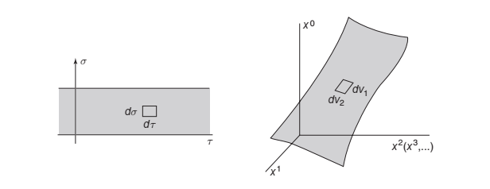

# Dinamik Tetangsi

## Lembar Dunia Tetangsi

Suatu zarah klasik ialah sejenis jasad titik bermatra--0. Lalu apabila ia merentasi ruang dan masa, ia menghasilkan suatu garis yang dipanggil garis dunia. Garis dunia inilah lintasan yang digunakan untuk membina tindakan dalam bab sebelum ini.

Berbeza dengan zarah bermatra-0, pergerakan tetangsi bermatra--1 akan menghasilkan satu lembaran bermatra--2. Jika lintasan zarah dipanggil garis dunia, maka lintasan tetangsi dipanggil lembar dunia. Tindakan untuk tetangsi adalah berkadaran dengan luas lembar dunia ini.

```{r Nambu, echo=FALSE, out.width="300px", fig.align="center", fig.cap="Kiri: Ruang parameter $X(\\tau, \\sigma)$. Kanan: Sebahagian lembar dunia yang dihasilkan oleh tetangsi sembarangan dalam ruang-masa $x^\\mu$ beserta suatu luas mahakecil yang membentuk paralelogram.\\\\ \\source{\\citet{Zwiebach2009}}"}

```
\par
Untuk memperoleh luas ini, kita takrifkan suatu ruang mahakecil pada lembaran tersebut. Ruang ini dihasilkan oleh vektor $\dd{v_1}$ dan $\dd{v_2}$. Vektor ini boleh dipetakan ke dalam ruang parameter $X(\tau, \sigma)$ lalu diterangkan oleh $\dd{\tau}$ dan $\dd{\sigma}$,
\begin{align}
\dd{v_1} &= \pdv{X}{\tau}\dd{\tau} = \dot{X} \dd{\tau},(\#eq:N0)\\
\dd{v_2} &= \pdv{X}{\sigma}\dd{\sigma} = X^\prime\dd{\sigma}.(\#eq:N1)
\end{align}
Parameter $\tau$ mewakili parameter mirip-masa dan $\sigma$ pula mewakili parameter mirip-ruang \citep{Zwiebach2009, Tong2009}. Kedua-dua parameter ini bebas ditakrifkan agar memudahkan pengiraan kerana tindakan tetangsi yang dihasilkan nanti adalah kalis tukar parameter sama seperti bagaimana persamaan Euler--Lagrange adalah kalis tukar koordinat.

Paralelogram yang dihasilkan oleh kedua-dua vektor tersebut merupakan hasil darab silang vektor-vektor itu,
\begin{equation}
\dd{A} = \dd{v_1} \times \dd{v_2} = \norm{\dd v_1}\norm{\dd v_2}\sin(\theta),
(\#eq:N2)
\end{equation}
dengan menggunakan $\theta$ untuk mewakili sudut dalaman yang dihasilkan $\dd{v_1}$ dan $\dd{v_2}$. 

Nilai $\norm{\dd{v_1}}\norm{\dd{v_2}}$ adalah bersamaan dengan $\sqrt{\qty(\dd v_1)^2\qty(\dd v_2)}$. Bagi memasukkan sekali ungkapan $\sin(\theta)$ ke dalam punca kuasa ini, kita letakkan kuasa dua padanya. Kemudian, menggunakan identiti trigonometri, $\sin[2](\theta) = 1-\cos[2](\theta)$.
\begin{align}
\dd{A} &= \sqrt{\qty(\dot{X} \dd{\tau})^2 \qty(X^\prime \dd{\sigma})^2 \qty(1-\cos[2](\theta))},(\#eq:N3)\\
\therefore\dd{A} &= \dd{\tau}\dd{\sigma}\sqrt{\qty(\dot{X})^2 \qty(X^\prime)^2-\qty(\dot{X} X^\prime\cos{\theta})^2}.(\#eq:N4)
\end{align}
Ungkapan $\dot{X}X^\prime \cos{\theta}$ adalah bersamaan dengan hasil darab dalaman $\dot{X}\vdot X^\prime$. Maka, pers. \@ref(eq:N4) boleh diungkapkan begini
\begin{equation}
\dd{A} = \dd{\tau}\dd{\sigma}\sqrt{\qty(\dot{X})^2\qty(X^\prime)^2-\qty(\dot{X}\vdot X^\prime)^2}
(\#eq:N4a)
\end{equation}

Ungkapan dalam punca kuasa pers. \@ref(eq:N4a) menyerupai penentu matrik $2\cross 2$,
\begin{align*}
\abs{\gamma_{\alpha\beta}} &= \gamma_{00}\gamma_{11} - \gamma_{01}\gamma_{10},\\
&= \qty(\dot{X})^2\qty(X^\prime)^2-\qty(\dot{X}\vdot X^\prime)\qty(\dot{X}\vdot X^\prime),
\end{align*}
apabila kita tetapkan metrik $\gamma_{\alpha\beta}$ sebagai
\begin{equation}
\gamma_{\alpha\beta} \equiv \begin{pmatrix}
\qty(\dot{X})^2 & \dot{X}\vdot X^\prime\\
\dot{X}\vdot X^\prime & \qty(X^\prime)^2\\
\end{pmatrix}.(\#eq:N6)
\end{equation}
Sebutan dalam punca kuasa itu dipastikan mempunyai nilai positif dengan memperkenalkan tanda negatif pada penentu metrik tersebut, $\sqrt{-\abs{\gamma_{\alpha\beta}}}$. Persamaan untuk luas mahakecil lembar dunia tetangsi ialah
\begin{equation}
\dd{A} = \dd{\tau}\dd{\sigma}\sqrt{-\abs{\gamma_{\alpha\beta}}}.
(\#eq:N5)
\end{equation}

## Tindakan Nambu--Goto

Tindakan tetangsi merupakan hasil kamiran terhadap luas lembar dunia yang diperoleh sebelum ini. Namun begitu, unit luas lembar ini tidak sama dengan unit tindakan. Oleh itu, akan ada satu pekali yang menemani kamiran tersebut,
\begin{equation}\label{A0}
S = \int L \dd{t} = \int T \dd{\tau}\dd{\sigma}\sqrt{-|\gamma_{\alpha\beta}|}.
\end{equation}
Pemalar $T$ tersebut boleh ditentukan sekiranya kita lihat suatu kes ketika tetangsi tersebut tidak bergerak langsung merentasi ruang dalam koordinat ruang--masa \citep{Tong2009}. 

Untuk kes ini, kita parameterkan $X$ agar mempunyai koordinat-koordinat ruang--masa,
\begin{equation}\label{A1}
X^\mu\qty(\tau,\sigma) = x^\mu(x^0,\vec{x}^n),
\end{equation}
dengan maksud $\vec{x}^n$ itu mewakili koordinat-koordinat ruang $(x^1,x^2,x^3,\cdots,x^n)$ yang bermula dari $n=1$. Simbol $x^0$ pula mewakili koordinat masa $ct$. Dengan menetapkan halaju tetangsi sifar, $\pdv{\vec{x}^n}{t} = 0$, nilai $\dot{X}$ kini hanya bergantung kepada parameter mirip-masa $x^0$ sahaja, dan $X^{\prime\mu}$ hanya bergantung kepada parameter mirip-ruang $\vec{x}^\mu$ sahaja,
\begin{align}
\mathnormal{\dot{X}^{\mu}} &= \begin{cases}
\dv{x^0}{\tau} &= 1\qif \mu=0,\\
\dv{\vec{x}^n}{\tau} &= 0\qif \mu\neq 0,
\end{cases}\label{A2}\\
X^{\prime\mu} &= \begin{cases}
\dv{x^0}{\sigma} &= 0\qif \mu = 0,\\
\dv{\vec{x}^n}{\sigma} &\neq 0 \qif \mu\neq 0.
\end{cases}\label{A3}
\end{align}

\par
Penentu metrik $\gamma_{\alpha\beta}$ kini boleh dicari. Memandangkan koordinat yang digunakan ialah koordinat ruang--masa kita boleh guna metrik Minkowski (pers. \ref{a6}). Menggunakan metrik Minkowski serta pers. (\ref{A2}) dan (\ref{A3}), kita dapati bahawa
\begin{align}
\qty(\dot{X})^2 &= \eta_{00}\dot{X}^0\dot{X}^0 = -1,\\
\qty(X^\prime)^2 &= \eta_{nn}X^{\prime n} X^{\prime n} = \qty(\dv{\vec{x}^n}{\sigma})^2,
\end{align}
dengan menggunakan simbol $n$ untuk menandakan indeks yang bukan sifar. Nilai $\dot{X}\vdot X^\prime = 0$ kerana kita mengenakan syarat bahawa ia berserenjang\citep{Zwiebach2009}. Lalu, penentu metrik $\gamma_{\alpha\beta}$ ialah,
\begin{equation}\label{A4}
\abs{\gamma_{\alpha\beta}} = (-1)\qty(\pdv{\vec{x}^n}{\sigma})^2.
\end{equation}
Lalu apabila pers. (\ref{A4}) dimasukkan ke dalam pers. (\ref{A0}), kita dapati
\begin{equation}\label{A5}
L \int \dd{t} = T \int \dd{\tau}\dd{\sigma}\sqrt{\qty(\pdv{\vec{x}^n}{\sigma})^2},
\end{equation}
dan sebutan $\dd{\tau}$ boleh diganti dengan $\dd{\tau} = c\dd{t}$. Sebutan $\int \dd{\sigma}\sqrt{\qty(\pdv{\vec{x}^\mu}{\sigma})^2}$ adalah bersamaan dengan panjang tetangsi tersebut, $\ell_s$ \citep{Zwiebach2009}, kerana pembezaan $\pdv{\vec{x}^\mu}{\sigma}$  mewakili vektor ruang menurut arah panjang tetangsi dan kamiran $\int \dd{\sigma}$ mewakili hasil tambah vektor tersebut dari pangkal tetangsi sehingga penghujung tetangsi.

Memandangkan dalam kes ini, tetangsi yang dinilai tiada komponen halaju, Lagrangiannya mewakili tenaga upaya, $V$, semata-mata,
\begin{equation}\label{A6}
-V \int \dd{t} = Tc\ell_s \int \dd{t}.
\end{equation}
Dengan membuang kamiran $\int\dd{t}$ di belah kiri dan kanan, kita dapati $T$ adalah bersamaan dengan tenaga upaya per unit panjang per unit halaju cahaya,
\begin{equation} \label{A7}
T = -\frac{V}{\ell_s c}.
\end{equation}
Pecahan $\frac{V}{\ell_s}$ merujuk kepada tenaga upaya yang disimpan dalam tetangsi dalam setiap unit kepanjangan tetangsi tersebut. Hal ini adalah sama dengan tegangan tetangsi, $T_0$. Persamaan yang diperoleh ialah Tindakan Nambu--Goto,
\begin{equation}\label{A8}
S_{NG} \equiv -\frac{T_0}{c} \int \dd{\tau}\dd{\sigma}\sqrt{-\abs{\gamma_{\alpha\beta}}}.
\end{equation}

Tegangan tetangsi $T_0$ mewakili jumlah tenaga yang disimpan dalam suatu unit panjang tetangsi \citep{Zwiebach2009}. Kita dapat lihat bahawa $T_0$ itu berkadaran dengan jisim tetangsi. Menggunakan kesetaraan jisim--tenaga Einstein, $E=mc^2$, kita boleh dapatkan perkaitan $T_0$ dengan $m$ dengan meletakkan $V = E$,
\begin{equation} \label{A7-1}
\frac{T_0}{c} = \frac{mc^2}{\ell_s c}.
\end{equation}
Menyusun semula sebutan-sebutan menggunakan kaedah aljabar lazim akan membawa kita ke persamaan
\begin{equation}\label{A7-2}
\mu_0 = \frac{m}{\ell_s} = \frac{T_0}{c^2},
\end{equation}
dengan maksud bahawa $\mu_0$ itu ialah jisim seunit panjang tetangsi. Hal ini bermakna hanya tetangsi-tetangsi yang tegang sahaja yang mempunyai jisim \citep{Zwiebach2009}.

## Persamaan Pergerakan Tetangsi

Menggunakan prinsip tindakan pegun, kita boleh munculkan persamaan pergerakan untuk tetangsi melalui tindakan Nambu--Goto. Mula-mula sekali, kita cari Lagrangian untuk tindakan Nambu--Goto,
$$S=\int L \dd{t}.$$
Namun, tindakan Nambu--Goto ialah kamiran terhadap parameter mirip ruang dan parameter mirip masa bukan semata-mata kamiran terhadap parameter masa sahaja. Oleh itu, Lagrangiannya perlu diturunkan unit, $\mathcal{L}$,
\begin{equation}\label{A10}
S = \int \pdv{L}{\sigma} \dd{\sigma}\dd{\tau} = -\frac{T_0}{c} \int \dd{\tau}\dd{\sigma}\sqrt{-\abs{\gamma_{\alpha\beta}}}.
\end{equation}
Lagrangian yang diturunkan unit ialah ketumpatannya. Kita akan tulis ketumpatan Lagrangian dengan simbol $\mathcal{L}$,
\begin{align}
\mathcal{L} &= \pdv{L}{\sigma},\notag\\
&= -\frac{T_0}{c} \sqrt{-\abs{\gamma_{\alpha\beta}}},\label{A10a}
\end{align}

\par
Bagi memperoleh persamaan pergerakan untuk tetangsi, prinsip tindakan pegun akan mengubah tindakan $S$ terhadap ketumpatan Lagrangian $\mathcal{L}$,
\begin{equation}
\delta S = \int \delta \mathcal{L} \dd{\sigma}\dd{\tau} = 0.
\label{A10b}
\end{equation}
Ketumpatan Lagrangian merupakan fungsi yang bergantung pada $\dot{X}^\mu$ dan $X^{\prime\mu}$ kerana wujudnya kebergantungan terhadap $\abs{\gamma_{\alpha\beta}}$ seperti yang ditunjukkan dalam pers. (\ref{A10a}). Oleh itu, perubahan ketumpatan Lagrangian boleh dikembangkan menjadi
\begin{equation}
\delta \mathcal{L} = \pdv{\mathcal{L}}{\dot{X}^\mu}\delta \dot{X}^\mu + \pdv{\mathcal{L}}{X^{\prime\mu}}\delta X^{\prime\mu}.
\label{A11}
\end{equation}
Kedua-dua $\delta \dot{X}^\mu$ dan $\delta X^{\prime\mu}$ boleh dikembangkan menjadi
\begin{equation}
\delta \dot{X}^\mu = \partial_\tau \qty(\delta X^\mu)\qc \delta X^{\prime\mu} = \partial_\sigma \qty(\delta X^\mu),
\label{A12}
\end{equation}
kerana perubahan terhadap pembezaan bergantung kepada perubahan pembolehubahnya. Pers. \ref{A10b} kini menjadi
\begin{equation}
\delta S = \int \pdv{\mathcal{L}}{\dot{X}^\mu}\partial_\tau \qty(\delta X^\mu) + \pdv{\mathcal{L}}{X^{\prime\mu}}\partial_\sigma \qty(\delta X^\mu) \dd{\sigma}\dd{\tau}.
\label{A13}
\end{equation}

\par
Pers. (\ref{A13}) boleh diringkaskan dengan memperkenalkan dua pembolehubah, $\mathcal{P}^\sigma_\mu$ dan $\mathcal{P}^\tau_\mu$,
\begin{align}
\mathcal{P}^\tau_\mu &= \pdv{\mathcal{L}}{\dot{X}^\mu},\label{A13a}\\
\mathcal{P}^\sigma_\mu &= \pdv{\mathcal{L}}{X^{\prime\mu}},\label{A13b}
\end{align}
yang menyerupai ketumpatan momentum tetangsi dari segi fungsinya. Ini adalah ketumpatan momentum konjugat. Yang akan menjadi ketumpatan momentum tetangsi ialah pers. (\ref{A13a}) kerana unitnya yang sepadan. Pencarian momentum akan dirisaukan dalam bahagian \@(persamaan-kedudukan-dan-momentum).

Perubahan tindakan kini menjadi,
\begin{equation}
\delta S = \int \mathcal{P}^\tau_\mu\partial_\tau \qty(\delta X^\mu) + \mathcal{P}^\sigma_\mu\partial_\sigma \qty(\delta X^\mu) \dd{\sigma}\dd{\tau}.
\label{A14}
\end{equation}
Pers. (\ref{A14}) boleh diselesaikan jika kedua-dua sebutan dalam kamiran itu dianggap sebagai hasil petua pembezaan hasil darab,
\begin{equation}
\partial_t \qty(u\vdot v) = u \qty(\partial_t v) + v\qty(\partial_t u).
\end{equation}
Jika dianggap bahawa $u = \mathcal{P}_\mu^\tau$, $v = \delta X^\mu$, dan $\partial_t = \partial_\tau$, mudah sahaja ditunjukkan bahawa persamaan ini benar,
\begin{equation}
\mathcal{P}^\tau_\mu\partial_\tau \qty(\delta X^\mu) = \partial_\tau\qty(\mathcal{P}_\mu^\tau \delta X^\mu) - \delta X^\mu\qty(\partial_\tau \mathcal{P}_\mu^\tau).
\end{equation}
Hal yang sama juga akan diperoleh untuk $\mathcal{P}^\sigma_\mu\partial_\sigma \qty(\delta X^\mu)$ jika digantikan pembolehubah yang sepatutnya. Oleh itu, pers. (\ref{A14}) untuk perubahan tindakan kini menjadi
\begin{equation}
\delta S = \int \qty(\partial_\tau\qty(\mathcal{P}_\mu^\tau \delta X^\mu) + \partial_\sigma\qty(\mathcal{P}_\mu^\sigma \delta X^\mu) - \delta X^\mu\qty(\partial_\tau \mathcal{P}_\mu^\tau + \partial_\sigma\mathcal{P}_\mu^\sigma))\dd{\sigma}\dd{\tau}.
\label{A15}
\end{equation}

\par
Persamaan ini kini boleh diselesaikan dengan mengenakan syarat sempadan. Persamaan ini serupa dengan pers. (\ref{S5}) yang digunakan untuk memperoleh persamaan Euler--Lagrange. Namun pers. (\ref{S5}) hanya ada satu sebutan sempadan yang dikamirkan terhadap masa manakala pers. (\ref{A15}) mempunyai dua sebutan sempadan, iaitu yang dikamirkan terhadap $\tau$ dan yang dikamirkan terhadap $\sigma$. Prinsip tindakan pegun menegaskan bahawa perubahan pada sempadan ialah sifar. Maka syarat sempadan kita menatijahkan,
\begin{align}
\int_{\sigma_0}^{\sigma_1} \partial_\sigma\qty(\mathcal{P}_\mu^\sigma\delta X^\mu)\dd{\sigma} &= 0,\\
\int_{\tau_0}^{\tau_1} \partial_\tau\qty(\mathcal{P}_\mu^\tau\delta X^\mu)\dd{\tau} &= 0.
\end{align}
Oleh itu, sebutan yang tinggal hanyalah
\begin{equation*}
\int - \delta X^\mu\qty(\partial_\tau \mathcal{P}_\mu^\tau + \partial_\sigma\mathcal{P}_\mu^\sigma)\dd{\sigma}\dd{\tau} = 0.
\end{equation*}
Kemudian, disebabkan $\delta X^\mu \neq 0$ kerana wujudnya perubahan pada koordinat untuk wujudkan perubahan tindakan, kita simpulkan bahawa
\begin{equation}
\partial_\tau \mathcal{P}_\mu^\tau + \partial_\sigma\mathcal{P}_\mu^\sigma = 0.
\label{A16}
\end{equation}
Inilah persamaan Euler--Lagrange untuk tetangsi kita. Sama seperti contoh jatuh bebas, kita akan gunakan persamaan ini untuk peroleh maklumat penting berkaitan pergerakan tetangsi. Kemudian, kita boleh wujudkan persamaan untuk pergerakannya.

## Persamaan Kedudukan dan Momentum

Bagi menyelesaikan persamaan Euler--Lagrange tetangsi, kita perlu dapatkan persamaan untuk $\mathcal{P}_\mu^\tau$ dan $\mathcal{P}_\mu^\sigma$. Hal ini boleh diperoleh melalui takrif yang diberikan sebelum ini iaitu dalam pers. (\ref{A13a}) dan (\ref{A13b}),
\begin{align}
\mathcal{P}_\mu^\tau &= \pdv{\mathcal{L}}{\dot{X}^\mu} = \pdv{\dot{X}^\mu}\qty(-\frac{T_0}{c}\sqrt{-\abs{\gamma_{\alpha\beta}}}),\\
\mathcal{P}_\mu^\sigma &= \pdv{\mathcal{L}}{X^{\prime\mu}} = \pdv{X^{\prime\mu}}\qty(-\frac{T_0}{c}\sqrt{-\abs{\gamma_{\alpha\beta}}}).
\end{align}
Memandangkan $\abs{\gamma_{\alpha\beta}} = \qty(\dot{X})^2\qty(X^\prime)^2-\qty(\dot{X}\vdot X^\prime)^2$, persamaan yang diperoleh untuk setiap satu itu ialah,
\begin{align}
\mathcal{P}_\mu^\tau &= -\frac{T_0}{c}\frac{\qty(\dot{X}\vdot X^\prime) X^\prime_\mu - \qty(X^\prime)^2\dot{X}_\mu}{\sqrt{\qty(\dot{X}\vdot X^{\prime})^2 - \qty(\dot{X})^2\qty(X^{\prime})^2}},\\
\mathcal{P}_\mu^\sigma &= -\frac{T_0}{c}\frac{\qty(\dot{X}\vdot X^\prime) \dot{X}_\mu - \qty(\dot{X})^2 X^\prime_\mu}{\sqrt{\qty(\dot{X}\vdot X^{\prime})^2 - \qty(\dot{X})^2\qty(X^{\prime})^2}}.
\end{align}
Apabila syarat keorthonormalan,
\begin{equation*}
\dot{X}\vdot X^\prime = 0\qc \qty(\dot{X})^2 + \qty(X^\prime)^2 = 0,
\end{equation*}
dikenakan kepada kedua-dua persamaan tadi, kita akan peroleh,
\begin{align}
\mathcal{P}_\mu^\tau &= -\frac{T_0}{c}\frac{\qty(-\qty(X^\prime)^2\dot{X}_\mu)}{\qty(X^\prime)^2} = \frac{T_0}{c}\dot{X}_\mu,\\
\mathcal{P}_\mu^\sigma &= -\frac{T_0}{c}\frac{\qty(-\qty(\dot{X})^2 X_\mu^\prime)}{-\qty(\dot{X})^2}= -\frac{T_0}{c}X^\prime_\mu.
\end{align}

\par
Kita akan naikkan indeks ketumpatan momentum konjugat ini agar sepadan dengan persamaan-persamaan lain yang diungkapkan dalam bentuk kontravarian. Hal ini boleh dicapai dengan mudah iaitu dengan meletakkan tensor metrik $\eta^{\mu\nu}$ sebagai pekali,
\begin{align}
\mathcal{P}^{\tau\mu} &= \eta^{\mu\nu}\mathcal{P}^\tau_\nu = \frac{T_0}{c}X^{\prime\mu},\label{A16a}\\
\mathcal{P}^{\sigma\mu} &= \eta^{\mu\nu}\mathcal{P}^\sigma_\nu = -\frac{T_0}{c}\dot{X}^\mu.\label{A16b}
\end{align}
Persamaan Euler--Lagrange tetangsi dalam bentuk kontravarian pula ialah
\begin{equation}
\partial_\tau \mathcal{P}^{\tau\mu} + \partial_\sigma\mathcal{P}^{\sigma\mu} = 0,
\label{A17}
\end{equation}
lalu apabila pers. (\ref{A16a}) dan (\ref{A16b}) diganti masuk ke dalam pers. (\ref{A17}),
\begin{equation}
\qty(\frac{T_0}{c})\qty(\partial_\tau \dot{X}^\mu - \partial_\sigma X^{\prime\mu}) = 0.
\end{equation}

\par
Jelas sekali, persamaan yang muncul ialah persamaan gelombang,
\begin{equation}
\ddot{X}^\mu - X^{\prime\prime\mu} = 0.
\label{A18}
\end{equation}

Persamaan ini memang sesuatu yang dijangkakan untuk objek yang menyerupai tangsi. Ia menunjukkan bahawa tetangsi dalam teori tetangsi bebas bergetar macam tangsi-tangsi pada gitar yang bebas bergetar menghasilkan bunyi-bunyian yang berbeza. Kita telah menunjukkan bahawa persamaan-persamaan yang diperoleh adalah persamaan yang sah untuk tetangsi.

Hakikat bahawa pers. (\ref{A18}) adalah persamaan gelombang membolehkan kita gunakan pengembangan Fourier untuk memperoleh $X^\mu$,
\begin{equation}
X^\mu = x^\mu_0 + \sqrt{2\alpha^\prime}\alpha^\mu_0\tau -i\sqrt{2\alpha^\prime}\sum_{n\neq 0}\frac{1}{n}\alpha^\mu_n e^{-in\tau}\cos(n\sigma),
\label{A19}
\end{equation}
dengan maksud bahawa $x_0^\mu$ ialah mod sifar, $\sqrt{2\alpha^\prime}\alpha^\mu_0\tau$ ialah sebutan momentumnya dan yang selebihnya ialah mod-mod getaran selain mod sifar. $\alpha_n^\mu$ ialah pekali mod getaran yang kompleks, manakala $\alpha^\prime$ ialah parameter cerun \citet{Zwiebach2009}. Parameter cerun ialah sejenis parameter dalam teori tetangsi yang berkait dengan tegangan tetangsi melalui
\begin{equation}
\alpha^\prime = \frac{1}{2\pi\hbar c T_0}.
\label{A20}
\end{equation}

\par
Momentum tetangsi boleh diperoleh daripada ketumpatan momentum yang disebut sebelum ini. Momentum, $p^\mu$, ialah hasil kamiran ketumpatan momentum konjugat berindeks $\tau$, $\mathcal{P}^{\tau\mu}$, terhadap parameter mirip ruang, $\sigma$, dari sifar ke $\pi$,
\begin{align}
p^\mu &= \int_0^\pi \mathcal{P}^{\tau\mu}\dd{\sigma},\\
&= \int_0^\pi \frac{T_0}{c}\dot{X}^\mu\dd{\sigma},
\end{align}
dan $\dot{X}^\mu$ boleh dikira daripada pers. (\ref{A19}) dengan membezakannya terhadap $\tau$,
\begin{equation}
\dot{X}^\mu = \sqrt{2\alpha^\prime}\qty(\alpha_0^\mu - \sum_{n\neq 0}\alpha_n^\mu e^{-in\tau}\cos(n\sigma)).
\end{equation}
Oleh itu, persamaan momentum kita ialah
\begin{equation}\label{A20a}
p^\mu = \frac{T_0}{c}\int_0^\pi \sqrt{2\alpha^\prime}\qty(\alpha_0^\mu - \sum_{n\neq 0}\alpha_n^\mu e^{-in\tau}\cos(n\sigma)) \dd{\sigma}.
\end{equation}

\par
Dengan menyelesaikan persamaan kamiran (\ref{A20a}), kita akan peroleh
\begin{equation}
p^\mu = \frac{T_0}{c}\sqrt{2\alpha^\prime}\alpha_0^\mu\eval{\sigma}_0^\pi.
\end{equation}
Apabila $T_0$ diungkapkan dalam bentuk $\alpha^\prime$ melalui pers. (\ref{A20}), persamaan untuk momentum ialah,
\begin{equation}
p^\mu = \frac{\alpha^\mu_0}{\sqrt{2\alpha^\prime}\hbar c^2}.
\label{A21}
\end{equation}
Momentum tetangsi adalah berkadaran dengan $\alpha_0^\mu$ yang berada dalam sebutan kedua pers. (\ref{A19}). Hal ini selari dengan yang dinyatakan sebelum ini iaitu sebutan kedua itu adalah sebutan momentum tetangsi tersebut.