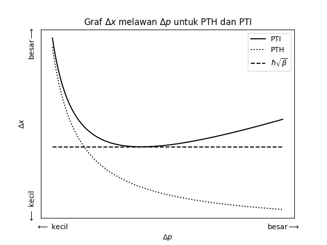

# Prinsip Ketakpastian

## Prinsip Ketakpastian Heisenberg

Penelitian Werner Karl Heisenberg terhadap cerapan-cerapan spektroskopi atom telah membawa beliau kepada persamaan matriks dengan bantuan Max Born dan Pascual Jordan \citep{Connes1994, Crease2002}. Natijah daripada mekanik matriks yang dibangunkan oleh Heisenberg ialah pembolehcerapnya tidak kalis tukar tertib. Khususnya, beliau mendapati bahawa pembolehcerap momentum dan kedudukan kuantum mempunyai hubungan begini,
\begin{equation}
\comm{\hat q}{\hat p} = i\hbar.(\#eq:pth-00)
\end{equation}

\par
Heisenberg menafsirkan hubungan penukar tertib ini sebagai hakikat bahawa dua pembolehcerap kuantum itu tidak boleh dicerap secara serentak dengan kejituan yang tinggi. Kejituan ukuran kedudukan, $\Delta x$, akan menjejaskan kejituan ukuran momentum, $\Delta p$, suatu zarah. Secara matematiknya, ia diungkapkan begini,
\begin{equation}
\Delta x \Delta p \geq \frac{\hbar}{2}.
(\#eq:pth-01)
\end{equation}
Ini adalah Prinsip Ketakpastian Heisenberg (PTH) dan prinsip ini merupakan tunjang mekanik kuantum.

## Daripada Tindakan Nambu--Goto

Terdapat dua kaedah untuk memperoleh prinsip ketakpastian untuk tetangsi. Kaedah pertama ialah dengan menggunakan penukar tertib yang boleh dihubungkan melalui kurungan Poisson. Ini adalah kaedah lokal. \citet{Boichenko2018} menunjukkan kaedah kedua iaitu melalui kaedah tak lokal. 

### Kaedah Penukar Tertib

Untuk memunculkan hubungan penukar tertib, kita perlu masukkan pembolehubah yang diperoleh dari bab \@ref(dinamik-tetangsi) ke dalam kurungan Poisson melalui perkaitan ini,
\begin{equation}
i\hbar\pb{a}{b} = \comm{a}{b}.
(\#eq:pth-01-a)
\end{equation}
Kurungan Poisson boleh diperoleh daripada persamaan
\begin{equation}
\pb{a}{b} = \sum_i \pdv{a}{q^i}\pdv{b}{p^i}-\pdv{b}{q^i}\pdv{a}{p^i},
(\#eq:pth-03)
\end{equation}
dengan maksud $q^i$ ialah koordinat teritlak dan $p^i$ momentum teritlak. Kita boleh gunakan $X^\mu$ dan $p^\mu$ yang diperoleh dalam bab \@ref(dinamik-tetangsi) untuk peroleh hubungan ketakpastian. Pertama sekali, sebutan pertama pers. \@ref(eq:pth-03) akan menjadi 1 kerana pembezaan masing-masing terhadap diri sendiri ialah 1,
\begin{align*}
\pdv{X^\mu}{X^\mu} &= 1,\\
\pdv{p^\mu}{p^\mu} &= 1.
\end{align*}

\par
Persamaan momentum yang diperoleh dalam pers. (\ref{A21}) menunjukkan bahawa ia tiada kebergantungan terhadap $X^\mu$. Maknanya, pembezaan momentum terhadap $X^\mu$ ialah sifar,
\begin{equation}
\pdv{p^\mu}{X^\mu} = 0.
\end{equation}
Hal ini menunjukkan bahawa sebutan kedua kurungan Poisson adalah sifar, tidak kiralah apa hasilnya dalam pembezaan $\pdv{X^\mu}{p^\mu}$ kerana sifar darab apa sahaja ialah sifar. Oleh itu,
\begin{equation}
\pb{X^\mu}{p^\mu} = 1
\end{equation}
ataupun umumnya
\begin{equation}
\pb{X^\mu}{p^\nu} = \delta^{\mu\nu},
\end{equation}
dengan maksud bahawa $\delta^{\mu\nu} = 1$ jika $\mu=\nu$ dan $\delta^{\mu\nu} = 0$ jika $\mu\neq\nu$. Melalui pers. \@ref(eq:pth-01-a), kita tahu bahawa
\begin{equation}
\comm{X^\mu}{p^\nu} = i\hbar\delta^{\mu\nu}.
\end{equation}


\par
Bagi memperoleh ketakpastian $\Delta X^\mu\Delta p^\nu$ daripada penukar tertib, kita perlu hubungkannya melalui ketaksamaan Cauchy--Schwarz,
\begin{equation}
\Delta X^\mu \Delta p^\nu \geq \norm{\frac{\comm{X^\mu}{p^\nu}}{2i}}.
\end{equation}
Maka, ketakpastian tetangsi ialah
\begin{equation}
\Delta X^\mu \Delta p^\nu \geq \frac{\hbar}{2}\delta^{\mu\nu},
\end{equation}
dan kita dapati ia sama dengan ketakpastian Heisenberg.
 
### Kaedah Tak Lokal

Pemerolehan ketakpastian tetangsi melalui kaedah tak lokal ditunjukkan oleh \citet{Boichenko2018}. Kita mulakan dengan menakrif halaju melintang supaya memegang nilai
\begin{align}
\vec{v_\perp} &= \pdv{\vec{X}}{t} - \qty(\pdv{\vec{X}}{t}\pdv{\vec{X}}{s})\pdv{\vec{X}}{s},\\
v_\perp^2 &= \qty(\pdv{\vec{X}}{t})^2 - \qty(\pdv{\vec{X}}{t}\pdv{\vec{X}}{s})^2,
\end{align}
dengan maksud bahawa $t$ ialah parameter masa dan $s$ ialah parameter ruang dan $\pdv{\vec{X}}{s}$ ialah vektor unit, $\qty(\pdv{\vec{X}}{s})^2 = 1$. Lalu, dengan syarat-syarat sebegini,
\begin{align}
\qty(\dot{X})^2 &= -c^2 + \qty(\pdv{\vec{X}}{t})^2,\\
\qty(X^\prime)^2 &= \qty(\pdv{\vec{X}}{\sigma}),\\
\dot{X}\vdot X^\prime &= \pdv{\vec{X}}{t}\vdot\pdv{\vec{X}}{\sigma},
\end{align}
kemudian dimasukkan ke dalam pers. (\ref{A13a}) dan (\ref{A13b}) untuk ketumpatan momentum, \citet{Boichenko2018} memunculkan persamaan-persamaan ini,
\begin{align}
\mathcal{P^{\tau\mu}} &= \frac{T_0}{c^2}\frac{\pdv{s}{\sigma}}{\sqrt{1-\frac{v_\perp^2}{c^2}}}\pdv{X^\mu}{t},\\
\mathcal{P^{\sigma\mu}} &= -T_0\sqrt{1-\frac{v_\perp^2}{c^2}}\pdv{X^\mu}{s}.
\end{align}
\par
Untuk $\mu=0$, \citet{Boichenko2018} mendapati bahawa $\pdv{X^\mu}{t} = c$ dan $\pdv{X^\mu}{s} = 0$. Maka,
\begin{equation}
\mathcal{P}^{\tau 0} = \frac{1}{c}\qty(\frac{T_0\pdv{s}{\sigma}}{\sqrt{1-\frac{v_\perp^2}{c^2}}}).
\end{equation}
Sebutan dalam kurungan itu merujuk kepada ketumpatan tenaga tetangsi tersebut. Bagi memperoleh tenaga tetangsi, kita kamirkannya terhadap $\dd{\sigma}$ lalu,
\begin{equation}
\frac{T_0\dd{s}}{\sqrt{1-\frac{v_\perp^2}{c^2}}} = \dd{E}.
\label{Boi1}
\end{equation}
Sebutan $\sqrt{1-\frac{v_\perp^2}{c^2}}$ ialah sebutan pembetulan yang muncul akibat kesan kenisbian am Einstein.

\citet{Boichenko2018} menggunakan hukum pergerakan Newton kedua untuk mengaitkan momentum dengan tegangan tetangsi. Perubahan momentum, $p$, sebahagian kecil tetangsi dipengaruhi oleh tegangan tetangsi tersebut,
\begin{equation}
T_0 = -\sum_i\dv{p_i}{t},
\end{equation}
dengan maksud bahawa $i$ ialah bahagian kecil tetangsi yang diambil kira. Pers. (\ref{Boi1}) kini menjadi,
\begin{equation}
\norm{\sum_i \dv{p_i}{t}\frac{\dd{s_i}}{\sqrt{1-\frac{v_\perp^2}{c^2}}}} = E.
\end{equation}
Sebutan momentum tadi dimutlakkan kerana yang penting ialah nilainya, bukan arahnya.
Menggunakan persamaan tenaga dalam bentuk frekuensi, $E=hf$, persamaan ini boleh dimunculkan,
\begin{equation}
\norm{\Delta p \Delta s} = \alpha\expval{\sqrt{1-\frac{v_\perp^2}{c^2}}}h,\label{Boi2}
\end{equation}
kerana $\int_{t=0}^{t=\frac{1}{f}} \dd t f =1$. Nilai momentum $\dd p_i$ dan $\dd s_i$ telah dijumlahkan untuk semua bahagian $i$ tetangsi. Kurungan siku $\expval{\sqrt{1-\frac{v_\perp^2}{c^2}}}$ itu menandakan purata nilai di dalamnya. Pekali $\alpha$ ialah pekali yang muncul akibat mencari purata.

Nilai momentum $p$ dan kedudukan $s$ berada dalam ruang vektor bermatra $N-1$. Oleh itu, pers. (\ref{Boi2}) sebenarnya mempunyai sumbangan dalam kesemua matra tersebut. Mengambil kira hal itu, pers. (\ref{Boi2}) kini menjadi,
\begin{equation}
\norm{\sum_{\mu=1}^{N-1}\Delta p_\mu\Delta s_\mu} = \alpha \expval{\sqrt{1-\frac{v_\perp^2}{c^2}}}h.
\end{equation}
Untuk mencari hasil darab $\Delta p_\mu \Delta s_\mu$ dalam satu matra sahaja, \citet{Boichenko2018} bahagikan dengan jumlah $N-1$ sebab dianggap bahawa nilainya dibahagi sama rata untuk kesemua matra. Dua andaian lanjut ialah bahawa $\alpha \approx 1$ dan bahawa pergerakannya tak bernisbi, iaitu $v_\perp \ll c$. Maka, \citet{Boichenko2018} memperoleh persamaan ini
\begin{equation}
\Delta p_\mu \Delta s_\mu \approx \frac{h}{N-1}.
\end{equation}
Nilai untuk $N$ ialah 11 seperti yang dipetik dalam \citet{Zwiebach2009}. Oleh itu, hasil akhirnya ialah $\frac{h}{10}$ yang hampir dengan nilai $\frac{h}{4\pi}$ yang digunakan dalam PTH. Perbezaan antara kaedah tak lokal \citet{Boichenko2018} dengan kaedah lokal ialah kaedah tak lokal membenarkan kita nampak kebergantungan ketakpastian tetangsi dengan matra ruang--masa. Kebergantungan ini tidak muncul dalam kaedah penukar tertib, sama ada sebab kebergantungan itu tidak wujud ataupun sebab ia tersembunyi di mana-mana.

## Prinsip Ketakpastian Teritlak

Meskipun PTH tidak membenarkan kedua-dua pembolehcerap dicerap dengan kejituan yang tinggi serentak, ia tetap membenarkan kita mencerap salah satu pembolehcerapnya dengan kejituan yang tinggi \citep{Tawfik2014}. Katakan kita langsung tidak tahu akan momentum zarah tersebut. Bila kita tiada maklumat tentang momentumnya, maka boleh dikatakan ketakpastiannya menghampiri infiniti, $\Delta p \to \infty$. Lalu keadaan tersebut,
$$\Delta x \geq \lim_{\Delta p \to \infty} \frac{\hbar}{2\Delta p},$$ akan membenarkan ketakpastian kedudukannya menghampiri sifar. Dalam erti kata lain, kita tahu secara tepatnya di mana letaknya zarah tersebut.

Semestinya, kejituan $\Delta x \to 0$ mengandaikan bahawa tiada kepanjangan minima. Kewujudan panjang minima akan memerlukan suatu sebutan tambahan yang akan mengehadkan kejituan kedudukan tersebut. PTH yang diubah suai untuk mengambil kira kepanjangan minima akan ditulis \citep{Kempf1996}
\begin{equation}
\Delta x \Delta p \geq \frac{\hbar}{2}\qty(1 + \beta \qty(\Delta p)^2).
(\#eq:pth-02)
\end{equation}
Dapat dilihat bahawa pers. \@ref(eq:pth-02) tidak membenarkan $\Delta x$ menghampiri sifar. Meskipun $\frac{\hbar}{2\Delta p}$ boleh menghampiri sifar apabila $\Delta p$ menghampiri $\infty$, sebutan $\beta\hbar \Delta p$ tidak menghampiri sifar. Oleh itu, sebutan tambahan ini akan menghalang $\Delta x$ menghampiri sifar lantas mengenakan panjang minima kepadanya. Persamaan yang diubah suai ini ialah Prinsip Ketakpastian Teritlak (PTI). 

Rajah \@ref(fig:uncertainty) melakarkan graf sempadan kedua-dua prinsip ini. Kewujudan panjang minima ini hanya akan muncul untuk saiz yang kecil iaitu sekitar saiz Planck, $\ell_P$. Untuk saiz-saiz yang besar, $\Delta x \gg \ell_P$, yang lazim dicerap, PTI akan menyerupai PTH.


```{r uncertainty, echo=FALSE, out.width="300px", fig.align="center", fig.cap="Graf $\\Delta x$ melawan $\\Delta p$ untuk kedua-dua prinsip ketakpastian serta had minima $\\Delta x_\\text{min} = \\hbar\\sqrt{\\beta}$. Prinsip Ketakpastian Heisenberg (PTH) membenarkan $\\Delta x$ menghampiri sifar manakala Prinsip Ketakpastian Teritlak (PTI) meletakkan had minima pada $\\Delta x$."}

```
\par
Kewujudan panjang minima merupakan natijah langsung daripada teori tetangsi kerana tetangsi-tetangsi tidak boleh berinteraksi dengan sesuatu yang lebih pendek dari panjang tetangsinya \cite{Tawfik2014}. Jika kita ingin mencerap panjang yang lebih pendek, kita perlukan pencerap yang bertenaga tinggi. Tetangsi-tetangsi yang bertenaga akan memanjang lalu akhirnya tidak mampu berinteraksi dengan benda-benda yang lebih pendek \cite{Witten1996}. Oleh itu, ada ruang yang langsung tidak boleh dicerap tetangsi, iaitu ruang yang lebih pendek dari kepanjangan asal tetangsi.

Hal ini selari dengan yang diusulkan oleh \citet{Amati1988}. Mereka meneliti sudut serakan tetangsi dan mengusulkan keperluan pengubahsuaian pada PTH dalam bentuk PTI. Para penyelidik lain juga bersetuju dengan keperluan PTI melalui pendekatan yang berbeza-beza. Misalnya, \citet{Konishi1990} menganalisis kes-kes kekisi tertentu lalu menatijahkan kewujudan PTI dari situ. Daripada keperluan ini, \citet{Kempf1996} dan \citet{Maggiore1993} meneroka kemungkinan mengubah aljabar Heisenberg agar mampu mendukung PTI.  Masing-masing dengan pemalar $\beta$ yang sembarangan.

Kelihatannya masih tiada kaedah dari persamaan dasar yang mampu memunculkan PTI melalui perkiraan rapi. Pendekatan-pendekatan yang dilakukan hanya menatijahkan wujudnya PTI dan kepanjangan minima berdasarkan analisis masing-masing. Seperti yang dilihat dalam tesis ini, kedua-dua pendekatan lokal dan tak lokal yang didasari tindakan Nambu--Goto memunculkan PTH bukannya PTI. Penulis masih tidak jumpa mana-mana penyelidik yang mampu memunculkan PTI daripada tindakan tetangsi.

Namun begitu, nampak seperti ada satu persamaan dengan pemalar lengkap yang bukan sembarangan yang muncul dari teori tetangsi hasil tinjauan \citet{Kuzmichev2019},
\begin{equation}
\Delta x \geq \frac{\hbar}{2 \Delta p} + \alpha^\prime\frac{\Delta p}{2\hbar}.
\end{equation}
Jadi, dalam persamaan ini, pemalar $\beta = \frac{\alpha^\prime}{\hbar^2}$. Persamaan ini dipetik dari \citet{Witten1996} yang diakui sendiri oleh penulis tersebut bahawa persamaannya agak goyah. Mungkin, pemilihan $\beta = \frac{\alpha^\prime}{\hbar^2}$ adalah supaya dimensi unitnya sepadan dengan $\Delta x$ dan tidak dimunculkan dari persamaan dasar. Ini petikan dari \citet{Witten1996},

> Namun begitu, mikroskop Heisenberg tak berfungsi dalam teori tetangsi jika tenaganya terlalu besar. Apa yang berlaku ialah tetangsi tersebut mengembang dan (jika ia dipecut melangkaui skala tetangsi) kita tidak mencerap jarak yang pendek tetapi sebaliknya hanya melihat perambatan tetangsi yang besar. **Ia seolah-olah prinsip ketakpastian secara kasarnya mempunyai dua sebutan,** $$\Delta x \geq \frac{\hbar}{\Delta p} + \alpha^\prime \frac{\Delta p}{\hbar}$$ dengan maksud bahawa sebutan pertama ialah ketakpastian kuantum yang dilazimi dan sebutan kedua mencerminkan suatu ketakpastian atau kekaburan yang baharu akibat dari teori tetangsi.  Dengan kedua-dua sebutan ini, wujudnya satu ketakpastian kepanjangan minima yang mutlak untuk mana-mana ujikaji sekitar $\sqrt{\alpha^\prime}\approx 10^{-32} \text{cm}$. **Akan tetapi, kerangka teori untuk sebutan tambahan itu masih belum muncul.**

Rujukan yang terkini juga ada menyatakan perkara yang serupa. \citet{Filho2016} menyatakan bahawa selama ini PTI dimunculkan melalui pengubahsuaian hubungan penukar tertib secara *ad hoc*. Nampaknya PTI masih belum dapat dimunculkan daripada persamaan yang mendasar.

Kita masih tiada kerangka teori yang kukuh untuk memunculkan PTI. Namun begitu, ramai bersepakat wujudnya jarak minima serta wujudnya PTI berdasarkan hujah-hujah. Malah, kesepakatan ini bukan sahaja sah untuk teori tetangsi, tetapi untuk banyak teori yang cuba merungkai graviti kuantum seperti yang ditinjau \citet{Tawfik2014}. Antara hujahnya ialah bahawa graviti memainkan peranan yang penting pada skala-skala yang pendek lalu mengubah hubungan ketakpastian.